# 🏦 AlphaCare Insurance Solutions (ACIS)
**End-to-End Insurance Risk Analytics & Predictive Modeling**  
**10 Academy – Week 1 Challenge | December 03–09, 2025**

[](#)
[](#)
[](#)
[](#)
[](https://opensource.org/licenses/MIT)

---

## Document Details

| Item                  | Details                                      |
|-----------------------|----------------------------------------------|
| **Author**            | Yodahe Tsegaye                               |
| **Date**              | December 07, 2025                            |
| **GitHub Repository** | https://github.com/Yodahe2021/ACIS_Insurance_Analytics.git |
| **Dataset**           | `MachineLearningRating_v3.txt` (~500+ MB)    |
| **Final Submission**  | December 09, 2025 – 8:00 PM UTC              |

---

# 1. Overview

This repository provides a complete end-to-end workflow for building a **risk analytics and predictive insurance pricing system** for AlphaCare Insurance Solutions (ACIS) operating in South Africa.

The project includes:

- ✔️ **Data ingestion & versioning** with DVC  
- ✔️ Comprehensive **Exploratory Data Analysis (EDA)**  
- ✔️ **Hypothesis Testing** (A/B statistical tests)  
- ✔️ Predictive Modeling  
  - Claim **Probability Model**  
  - Claim **Severity Model**  
  - Final **Risk-Based Premium Calculation**  
- ✔️ Automated visual reporting  
- ✔️ GitHub feature-branch workflow with pull requests  
- ✔️ Fully reproducible research environment

---

# 2. Infrastructure and Workflow

## 2.1 Project Structure & Version Control

The project uses a **Feature Branch Workflow**:  
`task-1` → `task-2` → `task-3` → `task-4` → merge to `main` through PRs.

### Project Directory (Rendered with Mermaid)

```mermaid
flowchart TD
  A["ACIS_INSURANCE_ANALYTICS/"]

  %% .dvc structure
  A --> dvc[".dvc/"]
    dvc --> dvc_cache["cache/files/md5/f6/"]
      dvc_cache --> dvc_hash["b7009b68ae21372b7deca9307fbb23"]
    dvc --> dvc_tmp["tmp/"]
      dvc_tmp --> btime["btime"]
      dvc_tmp --> lock["lock"]
      dvc_tmp --> rwlock["rwlock"]
      dvc_tmp --> rwlocklock["rwlock.lock"]
    dvc --> dvc_gitignore[".gitignore"]
    dvc --> dvc_config["config"]

  %% .venv
  A --> venv[".venv/"]

  %% data
  A --> data["data/"]
    data --> data_gitignore[".gitignore"]
    data --> mlrating["MachineLearningRating_v3.txt"]

  %% notebooks
  A --> notebooks["notebooks/"]
    notebooks --> nb_reports["reports/"]
    notebooks --> nb01["01_EDA_and_Stats.ipynb"]
    notebooks --> interpret["Model_Interpretation.ipynb"]

  %% reports
  A --> reports["reports/"]
    reports --> figures["figures/"]
      figures --> f1["01_loss_ratio_by_province.pdf"]
      figures --> f2["01_loss_ratio_by_province.png"]
      figures --> f3["02_claims_vs_premium.pdf"]
      figures --> f4["02_claims_vs_premium.png"]
      figures --> f5["03_claim_severity_vehicle.pdf"]
      figures --> f6["03_claim_severity_vehicle.png"]
      figures --> f7["04_loss_ratio_gender.png"]
      figures --> f8["05_monthly_trend.png"]
      figures --> f9["06_riskiest_postalcodes.png"]
      figures --> o1["output 1.png"]
      figures --> o2["output 2.png"]
      figures --> o3["output 3.png"]
      figures --> o4["output 4.png"]

  %% src
  A --> src["src/"]
    src --> hypo["hypothesis_testing.py"]
    src --> modeling["modeling.py"]

  %% root files
  A --> gitignore[".gitignore"]
  A --> dvcignore[".dvcignore"]
  A --> readme["README.md"]
  A --> req["requirements.txt"]
```


## 2.2 Data Version Control (DVC)

Task 2 is fully completed:

- `dvc init`  
- `dvc remote add` (Google Drive / Azure / Local storage)  
- `dvc add data/MachineLearningRating_v3.txt`  
- `dvc push`  

### Important Notes
- The raw dataset **is NOT stored in Git** — only a `.dvc` pointer file.  
- Running `dvc pull` fully restores the exact dataset version.  
- Ensures **full reproducibility**, essential for regulated industries such as insurance and finance.

---

# 3. Claims & Loss Ratio Figures

| #  | File Name                          | Description                                  |
|----|-------------------------------------|----------------------------------------------|
| 1  | 01_loss_ratio_by_province.pdf       | Loss ratio comparison across provinces       |
| 2  | 01_loss_ratio_by_province.png       | PNG version                                   |
| 3  | 02_claims_vs_premium.pdf            | Claims vs premium relationship                |
| 4  | 02_claims_vs_premium.png            | PNG version                                   |
| 5  | 03_claim_severity_vehicle.pdf       | Claim severity by vehicle type                |
| 6  | 03_claim_severity_vehicle.png       | PNG version                                   |
| 7  | 04_loss_ratio_gender.png            | Loss ratio comparison by gender               |
| 8  | 05_monthly_trend.png                | Monthly performance trend                     |
| 9  | 06_riskiest_postalcodes.png         | Top risky postal codes                        |
| 10 | output 1.png                        | Additional output                             |
| 11 | output 2.png                        | Additional output                             |
| 12 | output 3.png                        | Additional output                             |
| 13 | output 4.png                        | Additional output                             |

---

# 4. Exploratory Data Analysis (Task 1) — Summary

**Dataset Size:** 1,000,189 policies  
**Period:** Feb 2014 – Aug 2015  

---

## Key Insights

| Segment                | Loss Ratio | Insight & Recommendation                                |
|------------------------|------------|----------------------------------------------------------|
| Overall Portfolio      | ~1.0%      | Very profitable; majority of policies have zero claims   |
| Gauteng                | Highest    | Urban density → higher claim likelihood                  |
| Western Cape           | High       | Consider province-level risk loading                     |
| North West             | Lowest     | Strong candidate for **10–20% premium reduction**        |
| Eastern Cape           | Very Low   | High-margin segment → increase marketing investment      |
| Gender (M/F)           | Men higher | Requires statistical validation in hypothesis testing     |

---

## 5 Key Visualizations Generated

1. Loss Ratio by Province  
2. Claims vs Premium (log-log scale)  
3. Claim Severity by Vehicle Type  
4. Loss Ratio by Gender  
5. Monthly Loss Ratio Trend  
6. Riskiest Postal Codes  

---

---

# 6. How to Run This Project

```bash
# 1. Clone repo
git clone https://github.com/Yodahe2021/ACIS_Insurance_Analytics.git
cd ACIS_Insurance_Analytics

# 2. Install dependencies
pip install -r requirements.txt

# 3. Retrieve dataset via DVC
dvc pull

# 4. Run EDA notebook
jupyter notebook notebooks/01_EDA_and_Stats.ipynb
