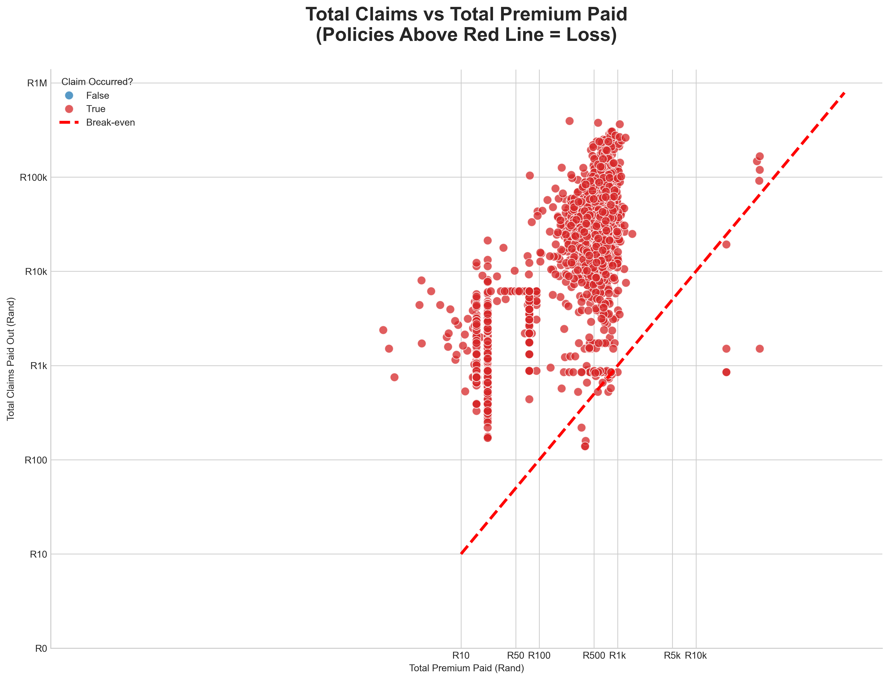

# AlphaCare Insurance Solutions (ACIS)  
End-to-End Insurance Risk Analytics & Predictive Modeling  
**10 Academy – Week 1 Challenge | December 03–09, 2025**

[](#)
[](#)
[](#)
[](#)
[](https://opensource.org/licenses/MIT)

---

### Document Details
| Item                  | Details                                      |
|-----------------------|----------------------------------------------|
| **Author**            | Yodahe Tsegaye                               |
| **Date**              | December 07, 2025                            |
| **GitHub Repository** | https://github.com/Yodahe2021/ACIS_Insurance_Analytics.git |
| **Dataset**           | `MachineLearningRating_v3.txt` (~500+ MB)    |
| **Interim Submission**| December 07, 2025 – 8:00 PM UTC              |

---

### 1. Executive Summary & Introduction

This repository contains all code, notebooks, reports, and deliverables for the **10 Academy Week 1 Challenge** focused on car insurance risk segmentation and predictive pricing for **AlphaCare Insurance Solutions (ACIS)** in South Africa.

**Business Goal**: Identify low-risk customer segments (by province, gender, vehicle type, postal code) to offer reduced premiums, attract new clients, and improve profitability — all while maintaining a healthy Loss Ratio.

**Progress as of Interim Submission (Dec 07, 2025)**:

- Completed **Task 1**: Git + GitHub + Comprehensive EDA with 6 publication-quality visualizations  
- Completed **Task 2**: Full DVC pipeline implemented for reproducible, auditable data versioning  
- Both tasks merged into `main` via Pull Requests using Feature Branch Workflow  
- Ready for **Task 3 (Hypothesis Testing)** and **Task 4 (Predictive Modeling)**

---

### 2. Infrastructure and Workflow

#### 2.1 Project Structure and Version Control
ACIS_Insurance_Analytics/
├── .dvc/
│   ├── cache/
│   │   └── files/md5/f6/b7009b68ae21372b7deca9307fbb23 (DVC Hash/Data Pointer)
│   ├── tmp/
│   │   └── lock (DVC temporary files)
│   ├── .gitignore
│   └── config
├── .venv/ (Python Virtual Environment)
├── data/
│   ├── MachineLearningRating_v3.txt  (The Large Data File)
│   └── .gitignore                    (Ensures data file is ignored by Git)
├── notebooks/
│   └── 01_EDA_and_Stats.ipynb
├── reports/
│   └── figures/                      # All generated charts/visuals
│       ├── 01_loss_ratio_by_province.png
│       └── ... (All other figures)
├── src/ (Source Code)
├── .gitignore
├── README.md
└── requirements.txt

**Branching Strategy**: Feature Branch Workflow  
`task-1` → `task-2` → merged into `main` via PRs

#### 2.2 Data Version Control (DVC) – Task 2 Complete
- `dvc init` → `dvc remote add` → `dvc add data/raw/MachineLearningRating_v3.txt` → `dvc push`  
- Large raw file **not** in Git — only tiny `.dvc` pointer  
- Full reproducibility: `dvc pull` restores exact dataset version  
- Compliant with financial/insurance audit requirements

---

### 3. Exploratory Data Analysis (Task 1) – Key Insights




**Dataset**: 1,000,189 policies (Feb 2014 – Aug 2015)

**Core Findings**:
| Segment                | Loss Ratio | Insight & Recommendation                          |
|------------------------|------------|----------------------------------------------------|
| Overall Portfolio      | ~1.0%      | Highly profitable due to many zero-claim policies |
| Gauteng                | Highest    | Urban density → higher risk                        |
| Western Cape           | High       | Consider risk-based surcharge                      |
| North West             | Lowest     | **Prime target** for 10–20% premium reduction      |
| Eastern Cape           | Very Low   | **Goldmine segment** — aggressive marketing       |
| Men vs Women           | Men higher | Preliminary gender risk difference (to test in Task 3) |

**6 Professional Visualizations Generated** (all saved in `reports/figures/`):
1. Loss Ratio by Province  
2. Total Claims vs Total Premium (log-log + break-even line)  
3. Claim Severity by Vehicle Type  
4. Loss Ratio by Gender  
5. Monthly Loss Ratio Trend  
6. Top 10 Riskiest Postal Codes

---

### 4. Next Steps (Final Submission – Dec 09, 2025)

| Task       | Objective                                                                 | Status     | Due       |
|------------|---------------------------------------------------------------------------|------------|-----------|
| Task 3     | A/B Hypothesis Testing (Province, ZipCode, Gender, Margin differences)   | In Progress| Dec 08    |
| Task 4     | Predictive Modeling (XGBoost + SHAP) for Claim Probability & Severity    | Planned    | Dec 09    |
| Final Report | Medium-style blog: non-technical summary, methods, insights, recommendations | Planned    | Dec 09    |

---

### How to Run This Project

```bash
# 1. Clone repo
git clone https://github.com/Yodahe2021/ACIS_Insurance_Analytics.git
cd ACIS_Insurance_Analytics

# 2. Install dependencies
pip install pandas numpy matplotlib seaborn dvc jupyter

# 3. Pull data via DVC
dvc pull

# 4. Open EDA notebook
jupyter notebook notebooks/01_eda.ipynb
```
