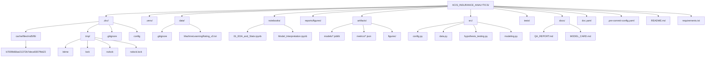

# 🏦 AlphaCare Insurance Solutions (ACIS)
**End-to-End Insurance Risk Analytics & Predictive Modeling**
**10 Academy – Week 1 Challenge | December 03–09, 2025**

[](#)
[](#)
[](#)
[](#)
[](https://opensource.org/licenses/MIT)

---

## Document Details

| Item                  | Details                                      |
|-----------------------|----------------------------------------------|
| **Author**            | Yodahe Tsegaye                               |
| **Date**              | December 07, 2025                            |
| **GitHub Repository** | https://github.com/Yodahe2021/ACIS_Insurance_Analytics.git |
| **Dataset**           | `MachineLearningRating_v3.txt` (~500+ MB)    |
| **Final Submission**  | December 09, 2025 – 8:00 PM UTC              |

---

# 1. Overview

This repository provides a complete end-to-end workflow for building a **risk analytics and predictive insurance pricing system** for AlphaCare Insurance Solutions (ACIS) operating in South Africa.

The project includes:

- ✔️ **Data ingestion & versioning** with DVC
- ✔️ Comprehensive **Exploratory Data Analysis (EDA)**
- ✔️ **Hypothesis Testing** (A/B statistical tests)
- ✔️ Predictive Modeling
  - Claim **Probability Model**
  - Claim **Severity Model**
  - Final **Risk-Based Premium Calculation**
- ✔️ Automated visual reporting
- ✔️ GitHub feature-branch workflow with pull requests
- ✔️ Fully reproducible research environment

---

# 2. Infrastructure and Workflow

## 2.1 Project Structure & Version Control

The project uses a **Feature Branch Workflow**:
`task-1` → `task-2` → `task-3` → `task-4` → merge to `main` through PRs.

### Project Directory (Rendered with Mermaid)


```mermaid
flowchart TD
  A["ACIS_INSURANCE_ANALYTICS/"]

  %% .dvc structure
  A --> dvc[".dvc/"]
    dvc --> dvc_cache["cache/files/md5/f6/"]
      dvc_cache --> dvc_hash["b7009b68ae21372b7deca9307fbb23"]
    dvc --> dvc_tmp["tmp/"]
      dvc_tmp --> btime["btime"]
      dvc_tmp --> lock["lock"]
      dvc_tmp --> rwlock["rwlock"]
      dvc_tmp --> rwlocklock["rwlock.lock"]
    dvc --> dvc_gitignore[".gitignore"]
    dvc --> dvc_config["config"]

  %% .venv
  A --> venv[".venv/"]

  %% data
  A --> data["data/"]
    data --> data_gitignore[".gitignore"]
    data --> mlrating["MachineLearningRating_v3.txt"]

  %% notebooks
  A --> notebooks["notebooks/"]
    notebooks --> nb01["01_EDA_and_Stats.ipynb"]
    notebooks --> interpret["Model_Interpretation.ipynb"]

  %% reports (published deliverables, never overwritten by a run)
  A --> reports["reports/figures/"]

  %% artifacts (generated, git-ignored)
  A --> artifacts["artifacts/"]
    artifacts --> models["models/*.joblib"]
    artifacts --> metrics["metrics/*.json"]
    artifacts --> figs["figures/"]

  %% src
  A --> src["src/"]
    src --> cfg["config.py"]
    src --> dat["data.py"]
    src --> hypo["hypothesis_testing.py"]
    src --> modeling["modeling.py"]

  %% tests and docs
  A --> tests["tests/"]
  A --> docs["docs/"]
    docs --> qa["QA_REPORT.md"]
    docs --> card["MODEL_CARD.md"]

  %% root files
  A --> dvcyaml["dvc.yaml"]
  A --> precommit[".pre-commit-config.yaml"]
  A --> readme["README.md"]
  A --> req["requirements.txt"]
```
## 2.2 Data Version Control (DVC)

`dvc.yaml` defines the two reproducible stages (`hypothesis_tests`, `train`), so `dvc repro`
rebuilds every metric and model from the extract.

> ⚠️ **The dataset itself is not yet under DVC.** No `.dvc` pointer is tracked and the configured
> remote is a local directory on the author's machine, so `dvc pull` exits 0 and restores nothing.
> Until the client supplies the extract and a shared remote, a clean clone **cannot** reproduce the
> published numbers. To close this (QA-001):
>
> ```bash
> dvc remote add -d storage s3://<bucket>/acis   # or gdrive://, azure://
> dvc add data/MachineLearningRating_v3.txt      # creates data/*.dvc, which IS tracked
> dvc push && git add data/*.dvc dvc.lock .dvc/config && git commit
> ```

Until then, run against a synthetic extract with the same schema, distributions and missingness:

```bash
python -m tests.synthetic_data     # writes data/MachineLearningRating_v3.txt
```

---

# 3. Published Figures

Generated by `notebooks/01_EDA_and_Stats.ipynb` against the full extract and committed under
`reports/figures/`. A pipeline run writes to the git-ignored `artifacts/figures/`, so the published
deliverables are never silently overwritten.

| File                             | Description                             |
|----------------------------------|-----------------------------------------|
| `01_loss_ratio_by_province.*`    | Loss ratio by province, with exposure   |
| `02_claims_vs_premium.*`         | Claims against premium (log scale)      |
| `03_claim_severity_vehicle.*`    | Claim severity by vehicle type          |
| `04_loss_ratio_gender.png`       | Loss ratio by gender (reported, not priced on) |
| `05_monthly_trend.png`           | Monthly loss-ratio trend                |
| `06_riskiest_postalcodes.png`    | Riskiest postal codes above the credibility threshold |

---

# 3.1 Quality Assurance

An end-to-end QA review — reproduction results, a findings register, gap analysis and the
remediation plan — is in [`docs/QA_REPORT.md`](docs/QA_REPORT.md). The pricing model's intended
use, limitations and monitoring plan are in [`docs/MODEL_CARD.md`](docs/MODEL_CARD.md).

The automated suite that backs it runs without the 500 MB dataset:

```bash
pip install -r requirements-dev.txt
pre-commit install
python -m tests.synthetic_data   # synthetic stand-in extract
pytest -m "not slow"             # contracts, units, quality gates, repo hygiene
pytest -m slow                   # full script and notebook execution
ruff check .
```

CI runs all of the above on every push. One finding is still open and is pinned as a strict
`xfail`: **QA-001**, the missing DVC pointer, which cannot be closed without the client's extract
and a shared remote.

---

# 4. Exploratory Data Analysis (Task 1) — Summary

**Dataset:** 1,000,189 policy-months, Feb 2014 – Aug 2015 (full extract).

| Measure | Value |
|---|---|
| Total premium | R61,911,563 |
| Total claims | R64,867,546 |
| **Overall loss ratio** | **104.77%** |
| Claim frequency | 0.28% of policies |
| Mean claim severity | ~R23,000 |

> **The book runs at an underwriting loss.** An earlier version of this page reported a "~1.0% loss
> ratio — very profitable" and recommended 10–20% premium *reductions*. That figure was the claim
> frequency, not the loss ratio; claims exceed premium by 4.8% before expenses. No segment may be
> cut on the basis of that earlier reading (QA-016).

## Key insights

| Segment | Finding | Action |
|---|---|---|
| Overall portfolio | Loss ratio 104.77%, i.e. R1.05 paid for every R1.00 earned | Rate increase or expense reduction, not a cut |
| Province | Loss ratio varies by province; Gauteng highest | Candidate rating factor, pending the corrected test below |
| Low-loss provinces | Lower observed loss ratio, but on thin exposure | Credibility-weight before any reduction |
| Postal code | Ranking is dominated by low-exposure codes | Do **not** rate on postal code without a credibility standard |
| Gender | 57% of the book is "Not specified" | Excluded from rating (see model card) |

> **Status:** the province and postal-code claims above come from the original loss-ratio
> aggregation, which does no significance testing. `python -m src.hypothesis_testing` now runs six
> hypotheses with Holm correction, effect sizes and exposure, and writes
> `artifacts/metrics/hypothesis_tests.json` — **but it has only ever been run against the synthetic
> extract.** Re-run it on the real data before any rate change; the corrected decisions, not this
> table, are the deliverable.

---

# 5. Modelling and Pricing (Task 4)

```text
pure premium  = P(claim) x E(claim cost | claim)
quoted premium = max( (pure premium + expense loading) / (1 - profit margin), expense floor )
```

With `EXPENSE_LOADING = R400` and `PROFIT_MARGIN = 8%`, the floor is **R434.78** — the cost of
writing a policy that never claims. Quotes are clamped to it, so no policy can be sold at a
guaranteed loss (QA-003).

| Component | Approach | Guard |
|---|---|---|
| Claim probability | XGBoost, isotonically calibrated | Brier score must beat the base rate; mean prediction must match the observed claim rate |
| Claim severity | XGBoost on `log(claim)`, selected by 5-fold CV against a mean baseline | Ships only if it beats the baseline out of fold; predictions are positive by construction |
| Missing rating factors | Median / "Unknown" imputation with missingness indicators | Every policy stays in the model; nothing is dropped (QA-005) |
| Outputs | `artifacts/models/*.joblib`, `artifacts/metrics/model_metrics.json` | Scoring never requires a retrain (QA-014) |

All parameters live in [`src/config.py`](src/config.py) and are copied into every metrics file, so
a saved run states the margin, loading and feature set it was produced under.

---

# 6. How to Run This Project

```bash
# 1. Clone repo
git clone https://github.com/Yodahe2021/ACIS_Insurance_Analytics.git
cd ACIS_Insurance_Analytics

# 2. Install dependencies (xgboost is pinned below 3.0: SHAP cannot read a 3.x booster)
python -m venv .venv && source .venv/bin/activate
pip install -r requirements.txt

# 3. Get the data
dvc pull                          # once the pointer exists - see 2.2
python -m tests.synthetic_data    # meanwhile: a synthetic extract with the same schema

# 4. Statistical testing and modelling
python -m src.hypothesis_testing  # -> artifacts/metrics/hypothesis_tests.{json,csv}
python -m src.modeling            # -> artifacts/models/*.joblib, artifacts/metrics/model_metrics.json

# 5. Notebooks
jupyter notebook notebooks/01_EDA_and_Stats.ipynb
